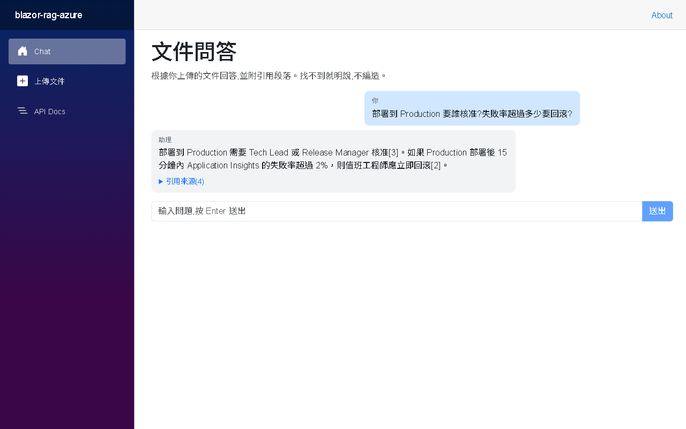
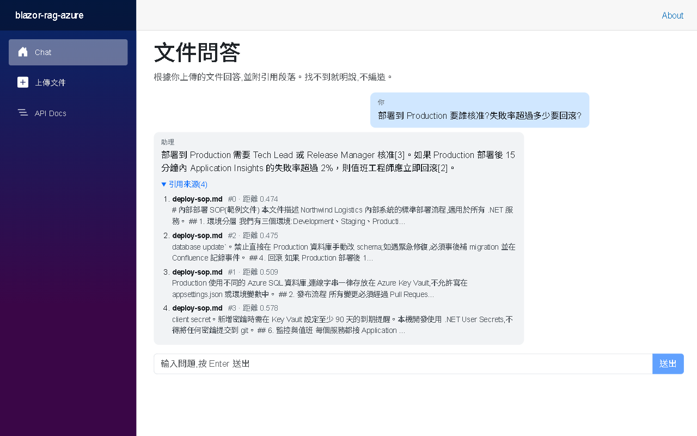
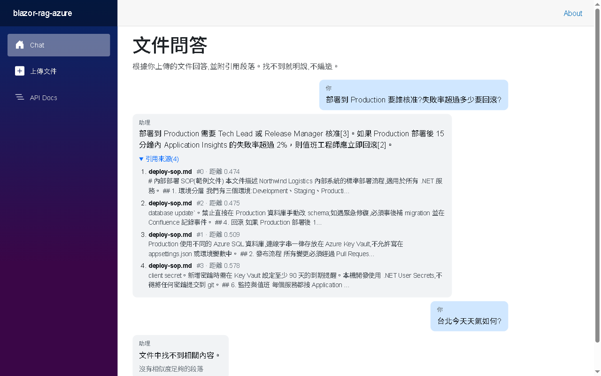
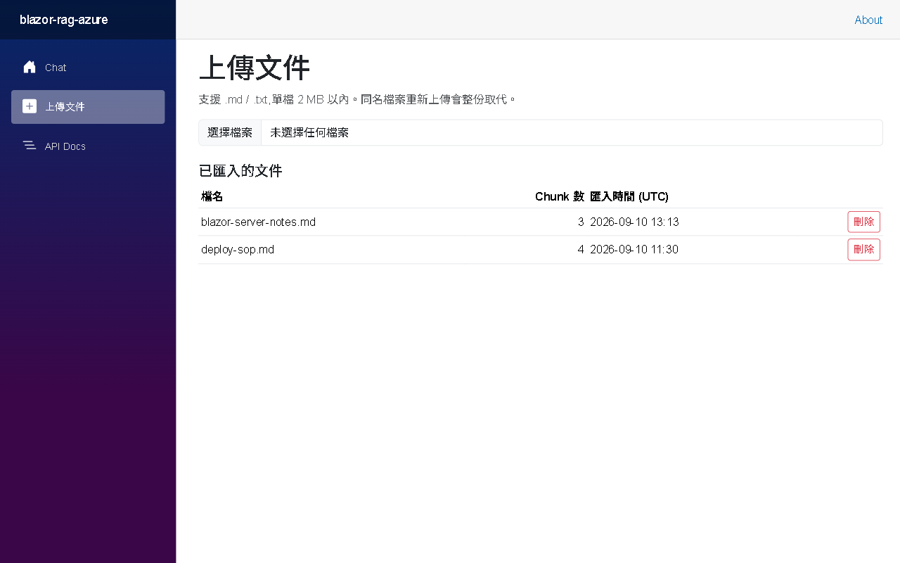
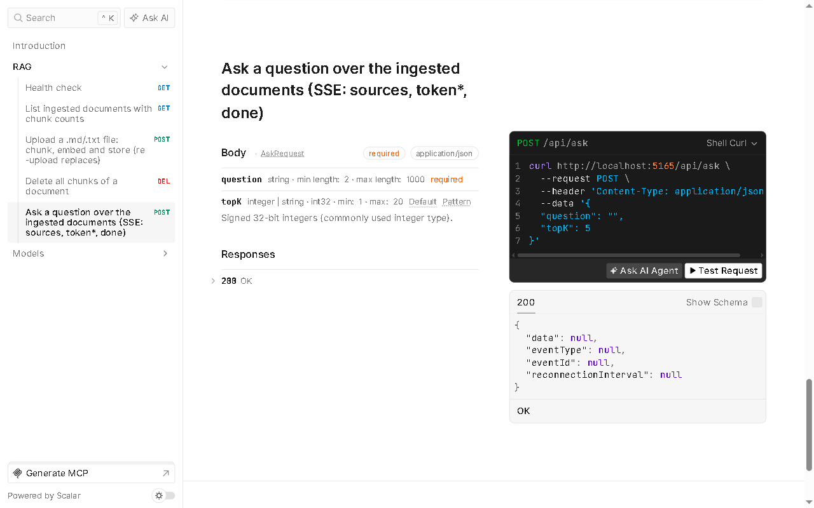

# blazor-rag-azure — 內部文件 RAG 問答（.NET 10 / Blazor Server / Azure）


上傳 .md / .txt → 段落感知切塊 → OpenAI embedding 存進 **SQL Server 2025 原生 `vector` 欄位** →
**Blazor Server** 聊天介面串流回答並附 **引用來源（檔名 / 段落 / cosine 距離）** →
同一套 Service 層另開 **Minimal API（SSE）** 給外部系統 → 部署到 **Azure，全鏈路零明文密碼**。

同一個 RAG 概念我做過兩套棧：[knowledge-agent](../knowledge-agent)（Python / pgvector / LangGraph / RAGAS）和這一套（.NET 10 / SQL Server vector / Microsoft.Extensions.AI）。本質都是 chunk → embed → top-K → prompt，差在放在哪個生態系。

> 🚀 **Live Demo**：（Phase 6 部署後補上）｜ 📘 **API 文件**：`/scalar`

---

## 進度

| Phase | 內容 | 狀態 |
|---|---|---|
| 1 | Blazor Web App（InteractiveServer）+ Minimal API + Scalar | ✅ |
| 2 | EF Core 10 `SqlVector<float>` + migration + Repository | ✅ |
| 3 | 上傳 → 切塊 → embedding → 存 DB（UI + API） | ✅ |
| 4 | 向量檢索 → prompt → 串流回答 + 引用來源 + 距離門檻 | ✅ |
| 5 | xUnit + NSubstitute，13 tests | ✅ |
| 6 | Azure App Service + Azure SQL | ⏳ |
| 7 | Key Vault + Managed Identity（零密碼） | ⏳ |
| 8 | GitHub Actions + Application Insights | ⏳ |

---

## Demo 截圖

### 1. 問答 — 串流回答，句尾 `[n]` 對應下方引用來源


### 2. 引用來源 — 檔名、段落編號、cosine 距離、摘要


### 3. 防幻覺 — 無關問題直接回「文件中找不到相關內容」，不呼叫 LLM


### 4. 上傳文件 — 切塊數量、重傳取代、刪除


### 5. Scalar API 文件 — `/api/ask` 的 SSE 端點與驗證規則


### 6. Azure — App Service 設定裡沒有任何密碼，全部來自 Key Vault


---

## 架構

```
瀏覽器 ──SignalR──▶ Blazor Server（Chat.razor / Upload.razor）
                          │ @inject，同程序直接呼叫
                    ┌─────▼──────────────────────────────┐
                    │ Services                            │
                    │  ChunkingService   純函數，段落優先  │
                    │  IngestService     chunk → embed → repo │
                    │  RagService        embed 問題 → top-K → 門檻 → prompt → 串流 │
                    └──┬──────────────────────┬──────────┘
             IChunkRepository       IEmbeddingGenerator / IChatClient
                    │                         │
        EF Core 10 + SQL Server 2025       OpenAI（key 缺席時自動換成 deterministic 替身）
                    ▲
外部系統 ──HTTP──▶ Minimal API /api/*（同一個 Service 層，SSE 串流）
```

**Blazor 不透過 HttpClient 打自己的 API**：Blazor Server 元件就跑在伺服器上，直接注入 Service；Minimal API 是給外部系統的第二個入口。兩個入口共用同一份邏輯。

---

## RAG Pipeline

| 步驟 | 做法 | 在哪 |
|---|---|---|
| 切塊 | 以空行分段、湊到 600 字換段、段間重疊 100 字、超長段落硬切 | `Services/ChunkingService.cs` |
| Embedding | `text-embedding-3-small`（1536 維），一次批次送 | `Services/IngestService.cs` |
| 儲存 | `vector(1536)` 欄位，`(SourceFile, ChunkIndex)` 唯一索引，重傳先刪後存 | `Data/DocumentChunk.cs`, `Data/ChunkRepository.cs` |
| 檢索 | `EF.Functions.VectorDistance("cosine", ...)` ORDER BY + TAKE topK，帶回距離 | `Data/ChunkRepository.cs` |
| 門檻 | 距離 > 0.65 的段落丟掉；全部被丟就回「找不到」且**不呼叫 LLM** | `Services/RagService.cs` |
| 生成 | System prompt 限制只能用參考段落、句尾標 `[n]`；`IChatClient` 串流 | `Services/RagService.cs` |
| 事件 | `IAsyncEnumerable<RagEvent>`：`SourcesEvent` → `TokenEvent*` → `DoneEvent(Grounded)` | `Services/RagService.cs` |

---

## API

| Method | Path | 說明 |
|---|---|---|
| GET | `/api/ping` | 健康檢查 |
| GET | `/api/documents` | 已匯入文件與 chunk 數 |
| POST | `/api/documents` | multipart 上傳 .md/.txt（2 MB 內），回 chunk 數；同名取代 |
| DELETE | `/api/documents/{file}` | 刪一份文件的所有 chunk |
| POST | `/api/ask` | `{question, topK}`（.NET 10 `AddValidation`）→ **SSE**：`sources`、`token*`、`done` |
| GET | `/scalar` | API 文件 UI |

```bash
curl -N -H "Content-Type: application/json" \
  -d '{"question":"Production 部署後失敗率超過多少要回滾?","topK":3}' \
  http://localhost:5165/api/ask
```

---

## 技術點 ↔ 程式碼對應

| 技術點 | 檔案 | 說明 |
|---|---|---|
| Blazor Server 全域 InteractiveServer | `Components/App.razor` | `<Routes @rendermode="InteractiveServer" />`；範本預設是靜態 SSR |
| Blazor 串流 UI + 取消 | `Components/Pages/Chat.razor` | `await foreach` + `StateHasChanged()`；`CancellationTokenSource` 停止；`IDisposable` 換頁取消 |
| 可重用元件 `[Parameter]` | `Components/SourceList.razor` | 引用來源清單 |
| CSS 隔離 | `*.razor.css` | build 自動加範圍屬性 |
| Blazor Server 的 DbContext 生命週期 | `Data/ChunkRepository.cs` | 注入 `IDbContextFactory`，每個操作短命 DbContext（Scoped = 整條 circuit 的雷） |
| EF Core 10 向量 | `Data/DocumentChunk.cs` | `SqlVector<float>` + `[Column(TypeName = "vector(1536)")]` |
| Minimal API 路由群組 / `TypedResults` / `Results<>` | `Api/ApiEndpoints.cs` | OpenAPI 自動推斷 200 / 400 / 404 |
| .NET 10 `AddValidation` | `Api/ApiEndpoints.cs` | `AskRequest` 的 `[Required]`、`[Range]` 自動回 400 ProblemDetails |
| .NET 10 `TypedResults.ServerSentEvents` | `Api/ApiEndpoints.cs` | `IAsyncEnumerable<SseItem<string>>` |
| Microsoft.Extensions.AI 抽象 | `Program.cs` | `IEmbeddingGenerator` / `IChatClient`，換 provider 不動業務碼 |
| 沒 key 也能跑 | `Services/Deterministic*.cs` | 同介面的替身，DI 依設定切換 |
| 可測試架構 | `tests/RagDemo.Tests` | 13 tests，全靠介面替身，不碰 DB / OpenAI；抓到一個 off-by-one |
| 設定分層 | `appsettings*.json` / User Secrets / Key Vault | 同一行 `Configuration["OpenAI:ApiKey"]`，本機與雲端來源不同 |

---

## 本地啟動

需求：.NET 10 SDK、Docker Desktop、OpenAI API key（沒有也能跑，會用 deterministic 替身）。

```bash
# 1. SQL Server 2025（vector 型別需要 2025+）
cp .env.example .env
docker compose up -d

# 2. OpenAI key 放 .NET User Secrets（不進 git）
dotnet user-secrets set "OpenAI:ApiKey" "sk-..." --project src/RagDemo.Web

# 3. 建表
dotnet ef database update --project src/RagDemo.Web

# 4. 跑
dotnet run --project src/RagDemo.Web        # http://localhost:5165
dotnet test                                  # 13 tests
```

或 Visual Studio 2026 開 `blazor-rag-azure.slnx` 按 F5。範例文件在 `docs/samples/`，從「上傳文件」頁丟進去即可問答。

---

## 設計取捨

| 決策 | 選擇 | 為什麼 |
|---|---|---|
| Blazor 執行模型 | Server，不用 WASM / Auto | JD 指定；元件可直接 `@inject` Service 和 EF，不需為瀏覽器再開一層 API |
| Blazor 要不要打自己的 API | 不要 | 同程序繞 HTTP 是反模式；API 定位為外部整合入口 |
| Vector store | SQL Server 2025 原生 `vector` | 一個 DB 同時放關聯資料和向量，Azure SQL 直接支援；EF 10 內建翻譯 |
| 向量索引 | 不建（精確搜尋） | `VECTOR_SEARCH` 在 SQL 2025 仍為預覽；千筆等級全掃 < 10 ms |
| 切塊 | 段落優先 + 固定上限 + 重疊 | 技術文件段落即語意單位；重疊防句子被切斷，代價是引用編號可能偏一格 |
| 找不到怎麼辦 | 距離門檻 + 不呼叫 LLM | 省 token、不編造；門檻 0.65 是看實際分布定的，換 embedding 模型要重調 |
| LLM provider | OpenAI 一把 key 做 embedding + chat | Claude 沒有 embedding API；`IChatClient` 抽象讓 chat 換 Claude 是一行 DI |
| 引用驗證 | 不做事後比對 | knowledge-agent 已示範 `[n]` 守門；這裡重點是 .NET 棧與 Azure |
| 全文檢索 / hybrid | 不做 | Docker mssql 映像沒 FTS；knowledge-agent 已示範 tsvector + RRF |
| 刪 + 存的交易 | 不包 | 重傳即修復；production 會合併成 `ReplaceDocumentAsync` 包交易 |
| 上傳端點防偽 | `DisableAntiforgery` | 外部 curl 沒有 antiforgery token；production 改 API key / JWT |

---

## 部署

Phase 6–8：Azure App Service（Linux）+ Azure SQL Database + Key Vault + System-assigned Managed Identity + GitHub Actions + Application Insights。目標是 App Service 設定裡**沒有任何一組密碼**，本機靠 `DefaultAzureCredential` 用 `az login` 身分讀同一個 Key Vault。完成後補上本節與 Live Demo。
