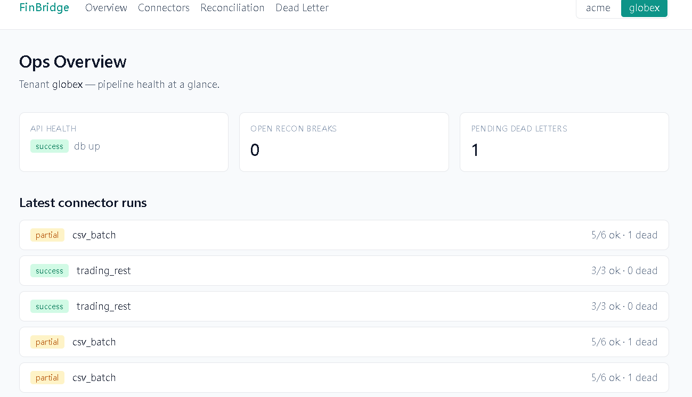
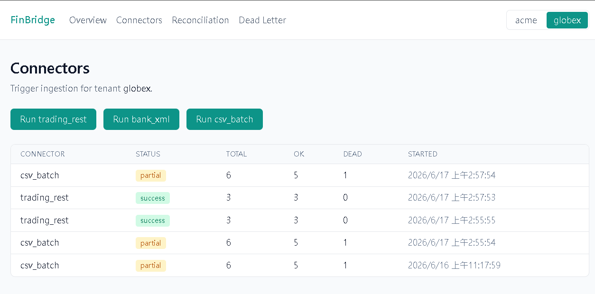
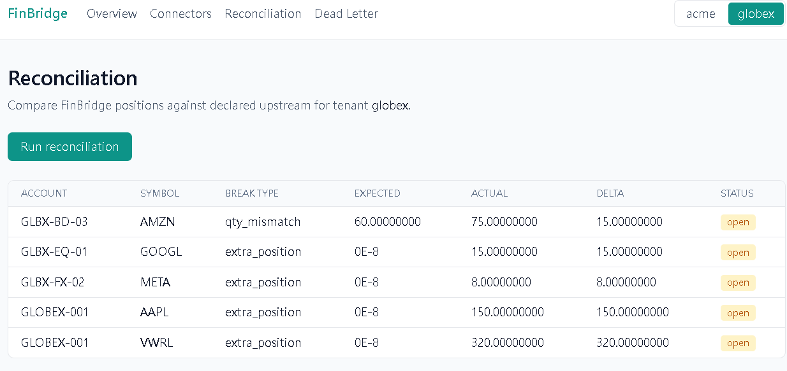
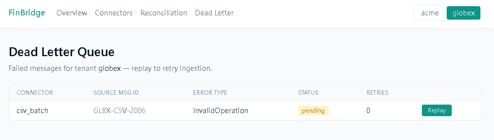
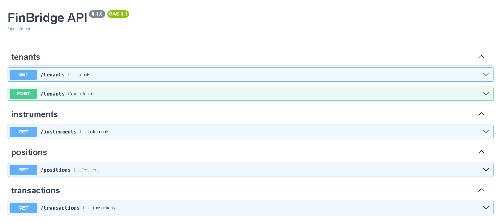
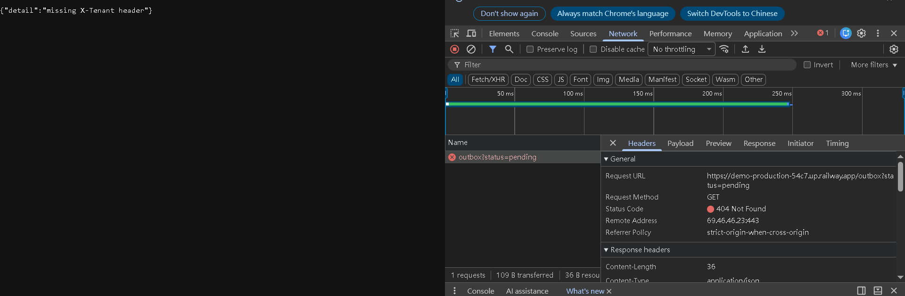

# FinBridge — 多租戶金融資料整合閘道


> 把多家券商/財管系統的**異質格式**(REST JSON 交易平台 + ISO 20022 **camt.053 XML** 銀行對帳單 + CSV 批次檔)接進來,**正規化成統一 canonical model**(證券/基金/債券/衍生品),對下游提供**統一 REST API**,並具備**冪等匯入 / 死信 / 重試 / 自動對帳**的 production 韌性,最後以 **Transactional Outbox + Kafka** 串流事件(可優雅降級)。

**刻意不放 AI** —— 本專案聚焦「整合的健壯性」,而非模型。

## Live Demo

- 🌐 前端(Vercel):https://demo-1bgd.vercel.app
- 📖 API Docs(Railway `/docs`):https://demo-production-54c7.up.railway.app/docs
- 💻 Repo:https://github.com/joy20020606/demo/tree/main/project/finbridge

> 試玩:右上切 **acme** → Connectors 跑 trading_rest → Reconciliation 跑對帳 → 看到 AAPL qty_mismatch delta 20。
> 切 **globex** → Connectors 跑 csv_batch → 出現 partial(有筆故意壞的) → Dead Letter 頁可以 Replay。

## Demo 截圖

| | |
|---|---|
|  |  |
|  |  |
|  |  |

## 架構

```
   上游(mock,自帶於 repo)                FinBridge 後端 (FastAPI :8002)            前端 (Next.js)
 ┌─────────────────────────┐         ┌──────────────────────────────────┐    ┌────────────────┐
 │ Trading Platform (JSON)  │──REST──▶│ connectors → normalize → 冪等upsert│    │ Ops Dashboard  │
 │ Core Bank (camt.053 XML) │──file──▶│       (transactions 表)           │◀───│ X-Tenant 切換器 │
 │ Batch (CSV)              │──file──▶│ 死信 / tenacity 重試 / replay      │    │ Connectors     │
 └─────────────────────────┘         │ 對帳引擎 (declared vs aggregated)  │    │ Reconciliation │
                                      │ ──存交易同筆寫 outbox──────────┐  │    │ Dead Letter    │
                                      └────────────────────────────────┼──┘    └────────────────┘
                                          ▲ publisher 輪詢 outbox        ▼
                                          │                      [Kafka / Redpanda]
                                          └─ consumer ◀──poll─────────┘ → notification_log
                                       (Outbox 模式:Kafka 永不在寫入路徑 → 優雅降級)

           PostgreSQL 16(多租戶,所有查詢以 tenant_id 隔離)
```

## 技術棧

| 層 | 技術 |
|---|---|
| 後端 | Python 3.12 + FastAPI + SQLAlchemy 2.0 (Mapped[]) + Pydantic v2 + psycopg3 |
| 資料層 | PostgreSQL 16(無 pgvector;`Numeric` 存金額/數量) |
| 整合 | httpx(REST)、lxml(ISO 20022 XML)、csv(批次)、tenacity(重試) |
| 事件流 | Transactional Outbox + confluent-kafka;本地 Redpanda、production Upstash Kafka |
| 前端 | Next.js 14.2 + TypeScript + Tailwind |
| 部署 | Railway(後端 + Postgres)+ Vercel(前端)+ Docker Compose(本地) |
| CI | GitHub Actions(ruff + pytest;前端 lint + build) |

## 技術點 ↔ 程式碼對應

| 技術點 | 檔案 |
|---|---|
| 多租戶隔離(X-Tenant header → tenant_id) | `backend/app/api/deps.py` |
| Canonical 資料模型(4 類金融商品) | `backend/app/db/models.py` |
| 三個 connector + 正規化 | `backend/app/connectors/`、`backend/app/normalize.py` |
| ISO 20022 camt.053 XML 解析(lxml) | `backend/app/normalize.py::normalize_camt_entry` |
| 冪等 upsert(ON CONFLICT DO NOTHING) | `backend/app/connectors/base.py::upsert_transaction` |
| 死信 + 重試 + replay | `backend/app/resilience/` |
| 對帳引擎 | `backend/app/reconcile.py` |
| Transactional Outbox + Kafka | `backend/app/connectors/base.py`、`backend/app/streaming/` |
| Ops Dashboard | `frontend/app/`、`frontend/components/` |

## 本地啟動

```bash
# 後端 + DB + mock 上游(Docker)
docker compose up -d --build
docker compose exec backend python -m app.db.init_db
docker compose exec backend python -m app.seed
curl.exe http://localhost:8002/health        # {"status":"ok","db":true}

# 前端
cd frontend && npm install && npm run dev     # http://localhost:3000

# 跑一輪整合流程(以 acme 租戶)
curl.exe -X POST -H "X-Tenant: acme" http://localhost:8002/connectors/trading_rest/run
curl.exe -X POST -H "X-Tenant: acme" http://localhost:8002/reconciliation/run
curl.exe -H "X-Tenant: acme" http://localhost:8002/reconciliation/breaks
```

### 事件流(可選,證明優雅降級)

```bash
# KAFKA_ENABLED=false(預設):跑 connector 後 outbox 累積 pending,API 照常 → 降級證明
curl.exe -H "X-Tenant: acme" "http://localhost:8002/outbox?status=pending"

# 開啟 Kafka:起 Redpanda,設 KAFKA_ENABLED=true,跑 publisher / consumer
docker compose up -d redpanda
docker compose exec -e KAFKA_ENABLED=true backend python -m app.streaming.publisher   # outbox → Kafka
docker compose exec -e KAFKA_ENABLED=true backend python -m app.streaming.consumer    # Kafka → notification_log
```

## 部署

- **後端 → Railway**:Dockerfile builder(`backend/railway.json`);`DATABASE_URL` 前綴改 `postgresql+psycopg://`;startCommand 以 `sh -c` 展開 `$PORT`。
- **前端 → Vercel**:root 設 `frontend/`;`NEXT_PUBLIC_API_URL` 填 Railway 網址(build-time,改值要取消 build cache)。
- **CORS**:後端 `CORS_ORIGINS` 填 Vercel 網址(不含尾斜線、用 https)。
- **Kafka(可選)**:Upstash Kafka 免費 tier,設 `KAFKA_ENABLED=true` + bootstrap + SASL;不設則優雅降級,其餘功能照常。

## 設計取捨(知道不做、知道為何不做)

- **不放 AI**:JD 講的是整合健壯性,不是模型。硬塞 RAG 是搞錯重點。
- **Transactional Outbox 讓 Kafka 成為 optional sink**:寫入路徑只寫自己 DB、從不呼叫 broker → Kafka 關閉/當機都不影響匯入與 API。
- **冪等靠 DB 約束**(`ON CONFLICT` + content hash):任何 connector / 死信 replay 都安全。
- **transient vs deterministic 分流**:網路類錯誤 tenacity 重試;資料類錯誤直接進死信,不做毒丸重試。
- **金額/數量一律 `Decimal`/`Numeric`**,永不用 float。
- **租戶身分一律 server-side 解析**(X-Tenant header),從不信任 client body。
- **無 Alembic**(demo 用 `create_all`);production 會補 migration + schema 稽核。
