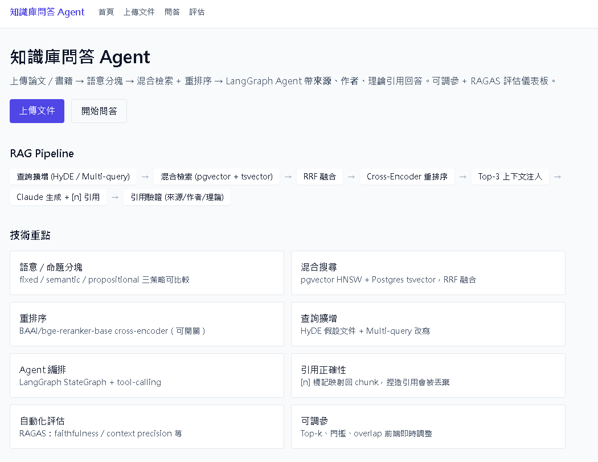
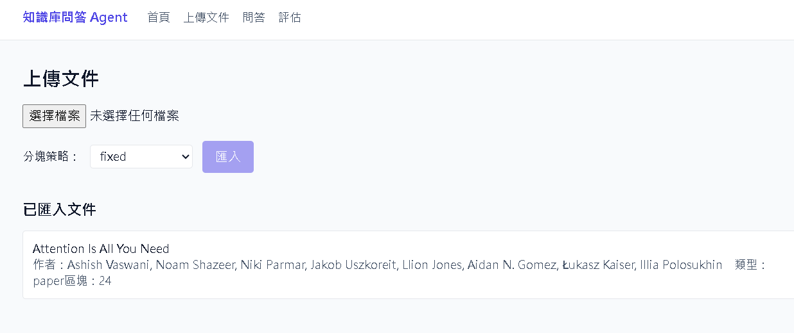
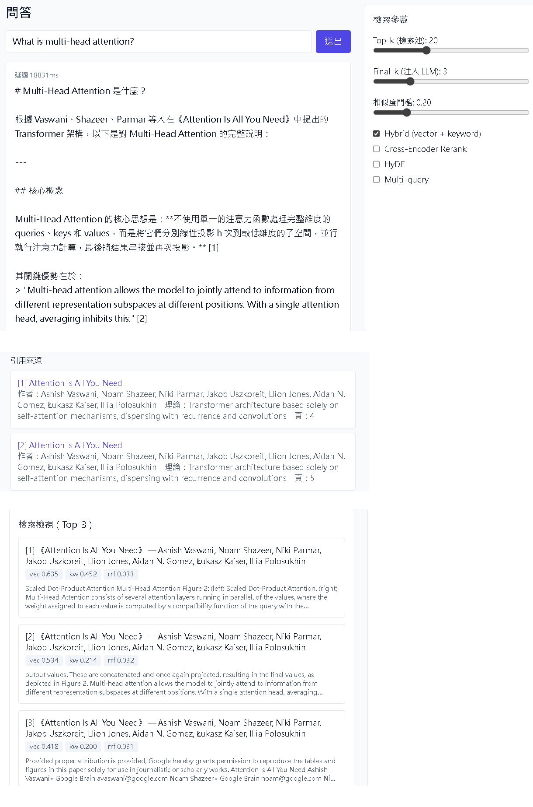
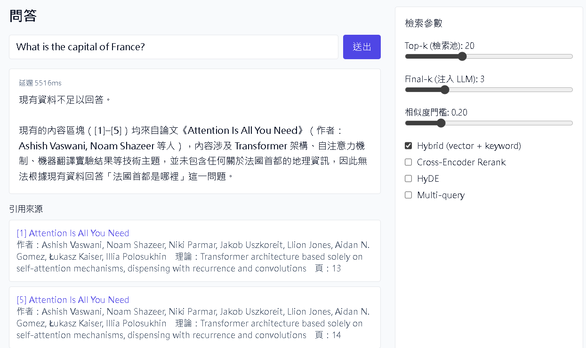
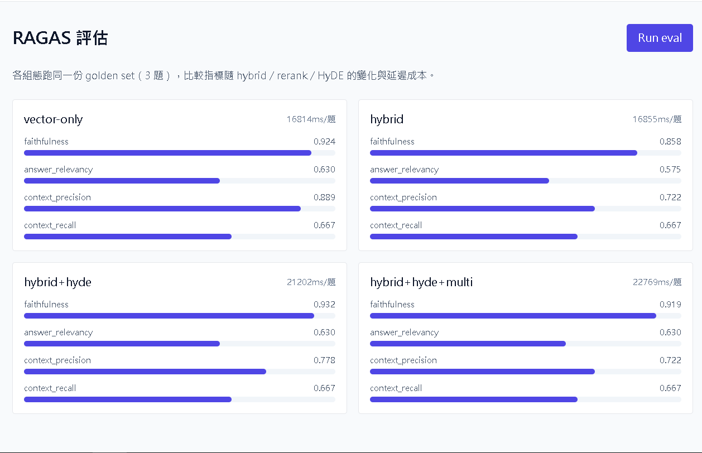
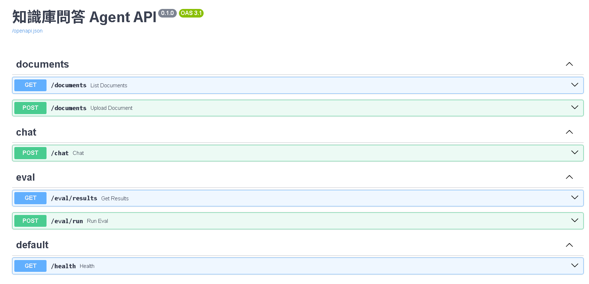

# 知識庫問答 Agent — RAG + LangGraph Demo


上傳論文／書籍 → 語意分塊 → **混合檢索（pgvector + tsvector）+ 重排序** → LangGraph
Agent 帶**來源 / 作者 / 理論**引用回答，並附 **RAGAS 自動化評估儀表板**。

Polyglot：**Python（FastAPI）RAG/Agent 後端 + TypeScript（Next.js）前端**。
部署：**Railway（後端 + Postgres/pgvector）+ Vercel（前端）**。

> **Live Demo**：前端 _（部署後填入 Vercel 網址）_ ｜ API 文件 _（部署後填入 Railway `/docs` 網址）_

---

## Demo 截圖

### 1. 首頁 — 技術重點一覽


### 2. 上傳文件 — 抽出書目 metadata（title / author / theory）


### 3. 問答 — 答案帶 `[n]` 引用，右側 RetrievalInspector 顯示 Top-3 各階段分數


### 4. 防幻覺 — 離題問題回傳「現有資料不足以回答」，不捏造引用


### 5. RAGAS 評估儀表板 — 4 配方比較（faithfulness / context precision …）


### 6. Swagger — Pydantic schema 自動產生的 OpenAPI 文件


---

## 架構

```
            Vercel                         Railway
  ┌─────────────────────┐      ┌──────────────────────────────┐
  │  Next.js (App Router)│ ───► │  FastAPI                      │
  │  /upload /chat /eval │ HTTP │  ├─ ingestion  (chunk+embed)  │
  │  TS · Tailwind       │      │  ├─ retrieval  (hybrid+rerank)│
  └─────────────────────┘      │  ├─ agent      (LangGraph)    │
                               │  └─ eval       (RAGAS)        │
                               │         │                     │
                               │   Postgres + pgvector         │
                               │   (HNSW + GIN/tsvector)       │
                               └──────────────────────────────┘
   Embeddings: OpenAI text-embedding-3-small   ·   生成/Agent: Claude
```

## RAG Pipeline

```
query
 → 查詢擴增 (HyDE + Multi-query)          retrieval/query_expand.py
 → 混合檢索 (pgvector ⊕ tsvector)          retrieval/{vectorstore,keyword}.py
 → RRF 融合                                retrieval/hybrid.py
 → 相似度門檻過濾 + Cross-Encoder 重排序     retrieval/{retriever,rerank}.py
 → Top-3 上下文注入 + Prompt Engineering   agent/graph.py
 → Claude 生成（強制 [n] 引用）
 → 引用驗證（捏造引用會被丟棄）             agent/citations.py
```

## 技術點 ↔ 程式碼對應

| 技術點 | 實作位置 |
|---|---|
| 語意 / 命題分塊 | `backend/app/ingestion/chunker.py`（fixed / semantic / propositional） |
| 查詢擴增 HyDE / Multi-query | `backend/app/retrieval/query_expand.py` |
| 混合搜尋 keyword + vector | `backend/app/retrieval/{keyword,vectorstore,hybrid}.py` |
| 重排序 Cross-Encoder | `backend/app/retrieval/rerank.py` |
| 參數調校 Top-k / 門檻 / overlap | `backend/app/config.py` + 前端 `RagConfigPanel` |
| 上下文注入 + 引用 | `backend/app/agent/{graph,citations}.py` |
| Multi-agent / tool-calling | `backend/app/agent/{graph,tools}.py`（LangGraph StateGraph） |
| 自動化評估 RAGAS | `backend/app/eval/run_ragas.py` |
| pgvector | `backend/app/db/models.py`（HNSW + 生成式 tsvector 欄位） |
| 全端 TS / Next.js | `frontend/` |

## 本地啟動

需 Docker。先填 `.env`（複製 `.env.example`），至少設 `OPENAI_API_KEY`（embedding）與
`ANTHROPIC_API_KEY`（生成）。

```bash
# 1) DB + 後端
docker compose up --build        # backend → http://localhost:8000  (/docs 看 OpenAPI)

# 2) 前端
cd frontend
cp .env.local.example .env.local
npm install && npm run dev       # → http://localhost:3000
```

不用 Docker 跑後端：

```bash
cd backend
pip install -e ".[dev,eval]"     # 要本地 rerank 再加 ,rerank
python -m app.db.init_db
uvicorn app.main:app --reload
```

## 評估

```bash
cd backend
python -m app.eval.run_ragas     # 跑 vector-only / hybrid / +rerank / +HyDE 四組態
```

結果寫入 `app/eval/results.json`，前端 `/eval` 以比較表呈現各指標與延遲。

## 設計取捨

- **Embedding 用 OpenAI、生成用 Claude**：Claude 無 embedding API，採多供應商各取所長。
- **tsvector 而非外掛 BM25**：零額外基建，`ts_rank_cd` 已足夠；RRF 以排名融合
  避開 cosine 與 ts_rank 不同尺度的問題。
- **重排序預設關閉**：cross-encoder 會拉進 torch（映像 +1~2GB）。`use_rerank` 開關即
  「精度↔成本」取捨，evaluation 儀表板將其具象化。
- **手刻 LangGraph 而非 `create_react_agent`**：後者已 deprecated；手刻清楚呈現
  retrieve → generate → validate 控制流與引用 retry 守門。

## 部署

- **Railway**：建 Postgres → `CREATE EXTENSION vector;`；用 `backend/railway.json`（Dockerfile builder）；
  設 `DATABASE_URL`（轉成 `postgresql+psycopg://…`）、`OPENAI_API_KEY`、`ANTHROPIC_API_KEY`、`CORS_ORIGINS`。
- **Vercel**：root 設 `frontend/`；env `NEXT_PUBLIC_API_URL` 指向 Railway 後端網址。
