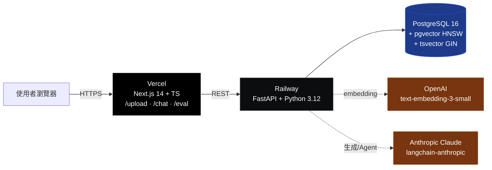
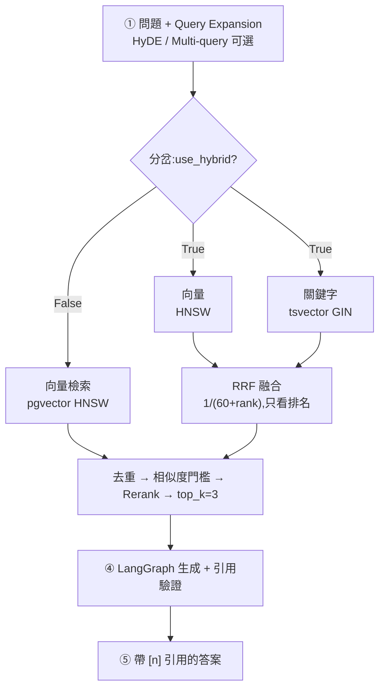
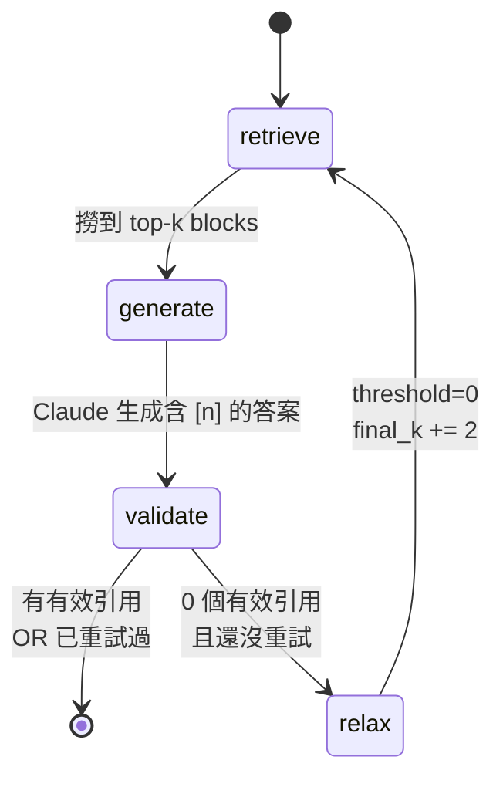
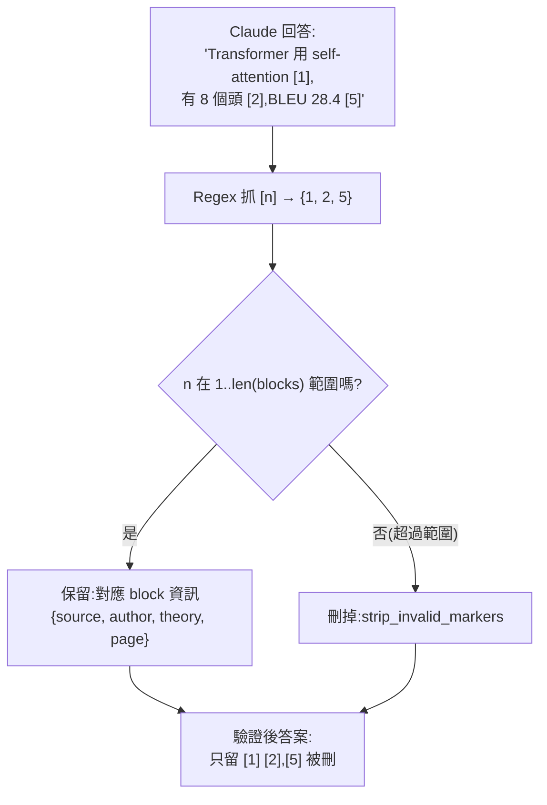
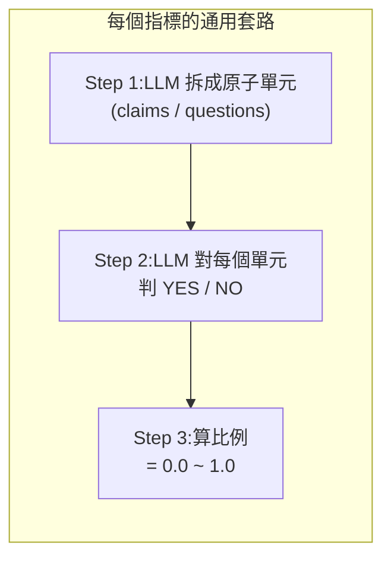
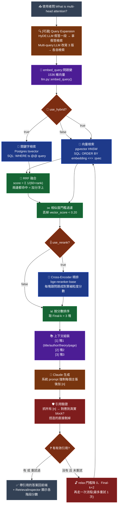

# knowledge-agent Demo 講解腳本

> 面試 / 錄 demo 時用。從對話歷史彙整,涵蓋核心心智圖 + 講解腳本 + 面試金句 + 名詞速查表。

## 目錄

1. 30 秒電梯簡報
2. 全景架構(Polyglot 部署)
3. RAG Pipeline(4 個開關決定行為)
4. LangGraph Agent 狀態機(防幻覺核心)
5. 引用驗證(citations.py 核心)
6. RAGAS 4 指標(用 LLM 當閱卷老師)
7. Demo 播放順序(3 分鐘)
8. 面試官可能問的 3 個問題 + 回答
9. 已知未做(誠實回答)
10. 心智圖 png 位置
11. **名詞速查表**(HNSW / BM25 / RRF / Bi-encoder / Cross-encoder)
12. **Rerank 實例對比**(具體看 bi-encoder 排錯 → cross-encoder 修正)
13. **`/eval` 頁面詳細講解**(4 指標 diagnostic + 反直覺故事)
14. **詳細版 Pipeline 心智圖**(逐節點口說腳本)

---

## 1. 30 秒電梯簡報

> 「這是一個 RAG + LangGraph Agent demo,主題是**學術文獻問答**。核心賣點三個:
> ① **混合檢索**——pgvector + tsvector + RRF 融合,自寫排名公式
> ② **引用防幻覺**——手刻 LangGraph state machine,Claude 捏造的引用會被驗證器丟棄
> ③ **RAGAS 自動評估**——跨 4 種配方比較,用數據證明檢索調校效果,結果反直覺:『複雜配方 ≠ 最佳結果』」

---

## 2. 全景架構(Polyglot 部署)



**講解重點**:
- Polyglot(Python + TS)反而是選擇,不是妥協——RAG 生態 Python 最完整
- 刻意用**兩家 LLM 供應商**:OpenAI 出向量、Claude 出答案(Claude 沒 embedding API)

---

## 3. RAG Pipeline(4 個開關決定行為)



**4 個開關對照表**(前端 `RagConfigPanel` 可即時調):

| 開關 | 開時做什麼 | 成本 |
|---|---|---|
| `use_hybrid` | 向量+關鍵字 RRF 融合 | +1 次 SQL |
| `use_rerank` | Cross-encoder 精排 top-N | 重(要 torch) |
| `use_hyde` | LLM 先「假裝回答」再檢索 | +1 次 LLM |
| `use_multi_query` | LLM 改寫成 3 問題並聯集 | +1 次 LLM |

**面試金句**:「這 4 個開關讓我能在 `/eval` 儀表板**用數據**證明每個決策——不是拿去堆功能,是拿去做取捨。」

---

## 4. LangGraph Agent 狀態機(防幻覺核心)



**核心邏輯**(`agent/graph.py`):
1. **retrieve** → 走完整檢索管線,回傳 top-k blocks
2. **generate** → Claude 看 blocks + 強制加 `[n]` 引用
3. **validate** → 抓答案裡所有 `[n]`,對不上 block 的**直接刪掉**
4. **needs_retry**:0 引用 且 未重試 → 走 relax;否則結束
5. **relax** → 門檻降到 0、final_k +2 → 再撈一次 → 給 Claude 再答一次

**面試金句**:
> 「我手刻 StateGraph 而非用 `create_react_agent`,因為後者已 deprecated 改 `langchain.agents.create_agent`;手刻能清楚展示控制流,且不被 API 改版影響。」

> 「離題問題(問『法國首都』)會誠實回『資料不足』——因為 Claude 找不到能標 `[n]` 的內容,validator 刪光所有捏造引用,relax 重試一次還是找不到就結束。這就是**引用正確性**的實作。」

---

## 5. 引用驗證(citations.py 核心)



**關鍵**:Claude 可能亂編 `[7]` 但只撈了 3 塊——**這種捏造引用會被無情刪掉**,答案裡永遠只留真實對應到 block 的引用。前端 `CitationCard` 拿到的 `citations` 陣列,每一筆都保證有出處。

---

## 6. RAGAS 4 指標(用 LLM 當閱卷老師)



**4 個指標差在「拆什麼」**:

| 指標 | Step 1 拆什麼 | Step 2 對誰判 | 抓什麼問題 |
|---|---|---|---|
| **faithfulness** | 拆「答案」的 claims | 對「contexts」判 YES/NO | 亂掰 / 幻覺 |
| **answer_relevancy** | 從「答案」反推 N 個問題 | 與原問題算 cosine | 答非所問 |
| **context_precision** | (不拆) | 對每個 context 判有用? | 相關塊排前面嗎 |
| **context_recall** | 拆「標準答案」的 claims | 對「contexts」判 YES/NO | 該撈的都撈到嗎 |

**面試金句**:
> 「RAGAS 不是黑魔法,本質就是『**叫 LLM 當閱卷老師 + 數 yes/no**』。我跑出來的結果反直覺:vector-only 反而 context_precision 最高——**提醒我不能因為功能炫就以為更好**。這就是用**數據驅動**檢索調校。」

---

## 7. Demo 播放順序(3 分鐘)

**開場(30 秒)**:秀 http://demo-z1s7.vercel.app/ 首頁

**Show 1:文件匯入(30 秒)**
- 開 `/upload`,傳 `attention-is-all-you-need.pdf`
- 講:PDF → chunking → OpenAI embedding → pgvector,24 塊入庫
- 亮點:**Claude 順便抽 metadata**(title/author/theory),之後引用能標

**Show 2:主問答(60 秒)**
- 開 `/chat`,問「**What is multi-head attention?**」
- 亮點三個:
  - 答案帶 `[1] [2] [3]` 引用
  - 右側 **RetrievalInspector** 顯示 top-3 塊各階段分數(vector/keyword/rrf)
  - 引用卡秀出 author / theory / page

**Show 3:防幻覺(30 秒)** ⭐ 最有記憶點
- 問「**What is the capital of France?**」
- 亮點:答「現有資料不足以回答」,**主動點名這些塊都是 Transformer 內容**
- 講:「LangGraph relax 重試 → 找不到 → citations 是空的 → 誠實拒答」

**Show 4:RAGAS 儀表板(30 秒)**
- 開 `/eval`,秀 4 配方比較表
- 亮點:「vector-only precision 反而最高——**如果沒這份評估我會盲目相信 hybrid 更好**」

---

## 8. 面試官可能問的 3 個問題 + 回答

**Q1:「你為何用 pgvector 不用 Pinecone / Weaviate?」**
> A:「demo 規模只要 1 個 Postgres 就搞定,pgvector 支援 HNSW + cosine ops,效能夠;更重要的是**同一個 DB 也能存 metadata 和關聯**,不用維護兩個系統。production 過了千萬向量規模再考慮專用 vector DB。」

**Q2:「為什麼手刻 LangGraph 不用 `create_react_agent`?」**
> A:「`create_react_agent` 已被官方標示 deprecated,改推 `langchain.agents.create_agent`。手刻有兩個好處:① 不被 API 改版影響;② 我能明確控制 retrieve → generate → validate → relax 的流程,尤其是**引用驗證失敗自動重試**這種守門邏輯,用 prebuilt 反而不好塞。」

**Q3:「Cross-encoder rerank 為什麼預設關?」**
> A:「這是**精度 vs 成本的取捨**——rerank 要 sentence-transformers + torch,Docker image 會多 1-2GB、cold start 慢。我把它做成 `use_rerank` flag,讓 `/eval` 能量化『開/關 rerank 對指標的影響』,證明是否值得那個成本。**production 決策不能靠感覺**。」

---

## 9. 已知未做(誠實回答)

- `DELETE /documents/:id`(scope 只做 ingest)
- 多文件串流上傳 UI
- LangSmith trace 截圖(env 有設但沒實跑)
- Golden set 只 3 題(production 應擴到 50-100 題)

**面試講法**:「demo 範圍我刻意收斂,production 版本這幾個是明確的下一步。」

---

## 10. 心智圖 png(如果面試官在看螢幕)

`docs/architecture/rag-pipeline-mindmap.png` — 你原本畫的那張色塊版,適合截圖分享。

---

## 11. 名詞速查表(面試常問)

### HNSW(Hierarchical Navigable Small World)

**是什麼**:pgvector 用的向量索引演算法,是**近似最近鄰(ANN)** 搜尋。

**類比**:找台北最近的便利商店。
- 暴力法:打電話問全台北 10000 間 → 100% 準但很慢
- HNSW:先看「市級地圖」(頂層稀疏節點)→ 「區級」→ 「街級」→ 3 步找到 → 快 100 倍,可能漏 1-2 間但夠好

**技術細節**:多層圖,top-down 從稀疏跳到密集。你 code 的參數:`m=16`(每節點連幾條邊)、`ef_construction=64`(建圖時搜尋深度)。

**位置**:`backend/app/db/models.py` `postgresql_using="hnsw"`

**面試金句**:「HNSW 是為了 scale——24 塊沒差,24 萬塊差 1000 倍」

---

### BM25(Best Matching 25)

**是什麼**:1990s 資訊檢索的經典**關鍵字排名**公式,是 Elasticsearch / Lucene 的預設。

**3 個核心因素**:
- **TF**:詞在文件出現幾次(**有飽和**,100 次不會比 10 次好 10 倍)
- **IDF**:這個詞多稀有(「the」低分,「Transformer」高分)
- **Doc length norm**:短文件命中 = 更相關;長文件靠字多取勝 = 打折

**你 demo 用了嗎?** ⚠️ 沒直接用 BM25,**用 Postgres 內建 `ts_rank_cd`——扮演相同角色**(關鍵字排名),差別是零額外基建。

**面試講法**:「demo 選 `ts_rank_cd` 是取捨——production 若需求增強,可裝 pg_bm25 extension 或外接 Elasticsearch」

---

### RRF(Reciprocal Rank Fusion)

**是什麼**:融合**多份排名清單**的演算法。**單一檢索不需要**(只有一份排名)。

**何時觸發**:
- ✅ `use_hybrid` on(向量 + 關鍵字兩份清單)
- ✅ `use_hyde` on(原問題 + HyDE 假答兩份排名)
- ✅ `use_multi_query` on(3 個改寫問題各一份)

**公式(白板題!)**:

```
某塊的 RRF 分數 = Σ  1 / (k + 該清單的名次)      k=60
```

**為什麼看名次不看分數**?因為向量 cosine(0~1)和 `ts_rank_cd`(任意浮點)**尺度不同**,直接加會被單邊主宰。**排名是通用尺度**。

**code 位置**:`retrieval/hybrid.py`,一行:`contribution = 1.0 / (60 + rank)`

**面試金句**:「我自寫 RRF 而非套內建 HybridSearchConfig,**面試時能白板寫公式**——證明我懂原理不是接線」

---

### Bi-encoder vs Cross-encoder(對比)

| 面向 | Bi-encoder(檢索) | Cross-encoder(rerank) |
|---|---|---|
| 誰跟誰算 attention | 問題自己算、塊自己算 | **問題 × 塊每個字互相 attend** |
| 分辨力 | 字面相近就給高分 | 真的懂「有沒有回答到」 |
| 速度 | 塊向量**可預先算好存 DB** → **快**(SQL) | 每次都要重跑 model → **慢** 100 倍 |
| 何時用 | 從 24 萬塊撈 top-20 | 對這 20 塊精挑 top-3 |
| 你的 code | pgvector `<=>` cosine | `BAAI/bge-reranker-base`(可選) |

**核心結論**:兩段式檢索是主流——**bi-encoder 廣撒網、cross-encoder 精挑**。

---

## 12. Rerank 實例對比(demo 講這段最有 fu)

### 情境:你問「How many heads does Transformer use?」

### Stage 1:bi-encoder + RRF 撈 top 5(快)

| 排名 | 塊 | 內容 | vector_score |
|---|---|---|---|
| 1 | p.4 塊A | "Multi-Head Attention consists of several attention layers..." | 0.61 |
| 2 | p.5 塊B | "In this work we employ **h = 8** parallel attention layers..." | 0.53 |
| 3 | p.2 塊C | "The Transformer follows an overall architecture..." | 0.51 |
| 4 | p.13 塊D | "Attention Visualizations..." | 0.49 |
| 5 | p.1 塊E | "Provided proper attribution..." | 0.44 |

**問題**:塊 A 排第 1,因為「Multi-Head Attention」字面**看起來**很像問題。**但真正答問題的是塊 B**(有 `h = 8`)。Bi-encoder 分不出這個細節。

### Stage 2:cross-encoder 精排(慢)

Cross-encoder 把 `(問題, 塊)` **一起丟進 BERT**,做 full attention:

```
輸入:[CLS] How many heads...? [SEP] In this work we employ h = 8... [SEP]
     ↓ BERT 12 層 attention(問題每個字對塊每個字 attend)↓
     [CLS] 位置向量 → linear classifier → relevance = 8.9
```

**跑完 5 塊後**:

| 排名 | 塊 | rerank_score | 變化 |
|---|---|---|---|
| **1** | **p.5 塊B**(h=8) | **8.9** | ↑ 從第 2 升到第 1 |
| 2 | p.4 塊A | 6.4 | ↓ |
| 3 | p.13 塊D | 2.1 | 從第 4 升到第 3 |
| 4 | p.2 塊C | -1.2 | ↓ |
| 5 | p.1 塊E(attribution) | **-4.8** | 被判「完全不相關」踢出 |

→ **塊 B 正確浮到第 1**;塊 E(版權宣告)被打成負分踢出。

### 一句話總結

> 「Bi-encoder 分不出『Multi-Head Attention **定義段**』和『**h = 8 實作段**』,cross-encoder 才能。**這就是為什麼要 rerank——bi-encoder 給你 20 個候選,cross-encoder 挑出真正答題的 3 個**。」

---

## 13. `/eval` 頁面 5 段講解腳本

### Step 1:秀畫面(10 秒)
> 「這是 RAGAS 評估儀表板,4 張卡片橫排,一張一個配方。」

### Step 2:講「我為什麼做這個」(30 秒)
> 「RAG 系統的準確度不能靠感覺,要用數據證明。
> 我跑了 4 種配方組合對同一份 golden set(3 題)評估:
> - **vector-only**(最單純,只向量)
> - **hybrid**(加關鍵字)
> - **hybrid + HyDE**(加查詢擴增)
> - **hybrid + HyDE + multi-query**(全開)」

### Step 3:解釋 4 個 RAGAS 指標(1 分鐘)
> 「這 4 個指標怎麼算?本質是『**叫 LLM 當閱卷老師**』:」

| 指標 | 抓什麼 | 演算法 |
|---|---|---|
| **faithfulness**(忠實度) | 亂掰 / 幻覺 | 拆答案成 claims → 對 context 判 yes/no → 算比例 |
| **answer_relevancy**(答案相關) | 答非所問 | 從答案**反推**可能問題 → 和原題算 cosine |
| **context_precision**(檢索精確) | 相關塊有排前面嗎 | 對每塊判有用? → MAP@K 加權 |
| **context_recall**(檢索召回) | 該找的都找了嗎 | 拆**標準答案**成 claims → 對 context 判 yes/no |

### Step 4:講反直覺結論(招牌 30 秒)⭐
> 「看這張表——**vector-only 的 context_precision 竟然最高**(0.889),打開 hybrid 反而掉到 0.722!
>
> 這推翻我原本『功能越多越好』的直覺——證明:**RAG 不能憑感覺接 LangChain,必須用數據驅動決策**。
>
> 如果沒這份自動評估,我會盲目相信 hybrid 更好,上線出事才發現。」

### Step 5:講 production 補強(展 senior 思維 30 秒)
> 「當然,3 題 golden set 統計顯著性不夠。
> Production 我會擴到 50-100 題、涵蓋不同題型(術語 / 口語 / 縮寫 / 跨段落),
> 才有足夠統計力做配方選擇。
> **這個 demo 的價值不是「找到最佳配方」,是「建立可重複的評估管線」**。」

---

### 4 個指標的 diagnostic 思維(面試官問「怎麼改進」時秀這個)

```
context_recall 低?         → 該找的塊沒撈到 → 調 Top-k 大、門檻低、加 HyDE
context_precision 低?      → 撈了但排序爛  → 加 rerank
faithfulness 低?           → Claude 亂掰   → context 太少?加 Final-k / 換強一點 LLM
answer_relevancy 低?       → 答非所問     → 改 system prompt / 換 LLM
```

→ **每個指標低對應不同修法**。這就是 RAGAS 有價值的地方——**告訴你 debug 方向**,不只是打分數。

---

### 逐配方解讀(如果被追問細節)

**vector-only**:faithfulness 0.924、precision 0.889 ⭐——最單純反而最好
**hybrid**:precision 掉到 0.722 → 關鍵字撈到雜訊
**hybrid + hyde**:faithfulness 0.932 ⭐ 最高 → HyDE 撈到更能支撐的 context
**hybrid + hyde + multi**:延遲最慢(22.7s)、分數沒進步 → **白花錢**

**故事鏈**:
1. 「單純可能就是最好」
2. 「hybrid 對純語意題型不加分」
3. 「HyDE 提升 faithfulness 值得」
4. 「Multi-query 對這批題目 = 燒錢不改善 → 該關」

---

## 14. 詳細版 Pipeline 心智圖(逐節點口說腳本)



### 逐節點口說腳本(demo 照這條線念)

1. 📥 **「使用者問一題」**
2. 🔍 **「(可選)先用 HyDE / Multi-query 加工,但預設關,省成本」**
3. 🎯 **「問題被 OpenAI 轉成 1536 維向量」**
4. 🔀 **「這裡有個分岔——純向量還是 hybrid?我打開 hybrid,所以下一步走兩條路」**
5. 🧠 📝 **「向量走 pgvector HNSW 找相近;關鍵字走 tsvector 找 exact match」**
6. 🎲 **「兩條結果用 RRF 融合——只看排名不看分數,兩邊都推薦的浮到最前面」**
7. ✂️ **「過濾掉相似度 < 0.20 的雜訊」**
8. 🎚️ **「Rerank 我預設關(展示成本取捨),所以直接按 RRF 分數排,取前 3 塊」**
9. 📚 🤖 **「這 3 塊格式化成上下文,連問題丟給 Claude,強制每個主張加 [n]」**
10. 🛡️ **「引用驗證器抓所有 [n],對不上塊的**直接刪**——這是防幻覺核心」**
11. ❓ **「如果 0 個有效引用,relax:門檻歸 0、Final-k+2,再撈一次;還沒就結束」**
12. ✅ **「答案 + 引用卡 + 檢索分數面板回前端」**

### 面試官若追問「4 個開關可以怎麼組合?」

| 情境 | 建議配方 |
|---|---|
| **快速原型 / 錢緊** | vector-only(單純、便宜) |
| **要精準 / 資料多** | hybrid + rerank(貴但準) |
| **用戶用詞跟文件差很多** | + HyDE(橋接詞彙) |
| **問題涵蓋多面向** | + Multi-query(多改寫) |
| **面試 demo** | vector-only + hybrid + HyDE(RAGAS 證明過的甜蜜點) |

→ 這個表本身就是「**依情境調校**」的具體證據。
