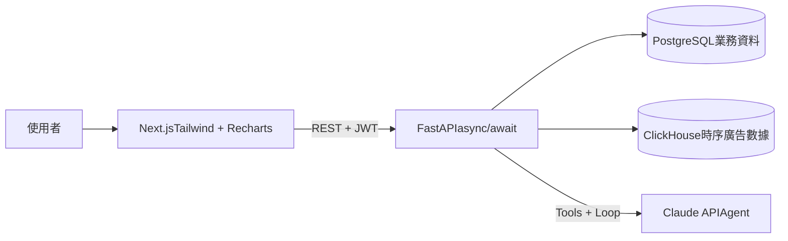
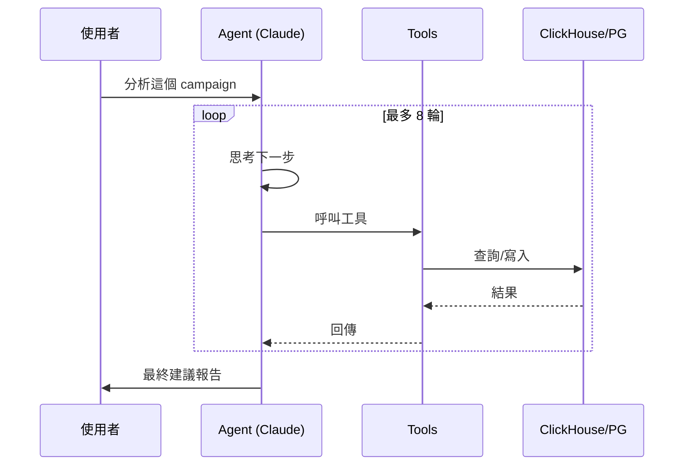

# Mini Amazon Ads AI Dashboard


> 求職作品集 demo:FastAPI + Next.js + PostgreSQL + ClickHouse + Claude Agent

模擬 Amazon 賣家廣告數據分析平台,重點展示:
- ✅ FastAPI + async/await + JWT 認證
- ✅ 多租戶 SaaS(tenant_id 隔離)
- ✅ PostgreSQL(業務資料)+ ClickHouse(時序廣告數據)雙層架構
- ✅ Next.js 14 App Router + TypeScript + Tailwind
- ✅ Claude Agent 自動分析 ACOS 並給建議
- ✅ Docker Compose 一鍵啟動

## 🎬 Demo

### 廣告活動列表(多租戶 + ClickHouse 即時聚合)


### 詳細頁(時序圖表展示 ACOS 異常)


### Claude Agent 自動分析(真實串接,非 mock)


---

## 🏗 架構圖



## 🚀 啟動

```bash
# 1. 設定環境變數
cp .env.example .env
# 編輯 .env,填入 ANTHROPIC_API_KEY

# 2. 啟動所有服務
docker compose up -d --build

# 3. 等服務起來後初始化(約 30 秒)
docker compose exec backend python -m scripts.init_db
docker compose exec backend python -m scripts.seed_data

# 4. 開啟瀏覽器
# 前端:        http://localhost:3000
# API 文件:    http://localhost:8000/docs
# ClickHouse:  http://localhost:8123/play
```

預設帳號:`joy@test.com` / 密碼:`password123`

## 📁 結構

```
mini-amazon-ads-ai/
├── backend/                FastAPI 後端
│   ├── app/
│   │   ├── api/            API routes(auth、campaigns、ai)
│   │   ├── core/           設定、資料庫、安全
│   │   ├── models/         SQLAlchemy ORM
│   │   ├── services/       業務邏輯 + AI Agent
│   │   └── main.py
│   ├── scripts/            初始化 + 種子資料
│   ├── requirements.txt
│   └── Dockerfile
├── frontend/               Next.js 前端
│   ├── app/                App Router 頁面
│   ├── components/         React 元件
│   ├── lib/                API client
│   ├── package.json
│   └── Dockerfile
├── docker-compose.yml
├── .env.example
└── README.md
```

## 🎯 功能展示

| 路徑 | 說明 |
|------|------|
| `/login` | JWT 登入 |
| `/campaigns` | 廣告活動列表 + ACOS 指標 |
| `/campaigns/[id]` | 詳細頁 + 時序圖表(查 ClickHouse) |
| `/campaigns/[id]/ai` | Claude Agent 分析 + 建議 |

## 💡 技術選型理由

| 選擇 | 為什麼不選別的 | 為什麼選這個 |
|------|---------------|--------------|
| **ClickHouse**(時序層) | PostgreSQL 也能做,但聚合查詢慢 | 廣告 metrics 是「只寫不改、聚合主導」場景,ClickHouse 比 PG 快 10–100 倍,壓縮率也高 |
| **PostgreSQL**(業務層) | NoSQL 寫入更快 | 需要 ACID 事務(會員、租戶設定),關聯式 schema 更適合業務資料 |
| **FastAPI**(後端) | Flask 較成熟、Django 功能全 | 異步原生支援,呼叫 Amazon API + Claude API 時併發優勢明顯;自動產生 OpenAPI docs |
| **Next.js App Router** | 純 React + Vite | Server Components 可在伺服器直接抓 API,降低 token 暴露;與 shadcn/ui 整合最順 |
| **Docker Compose** | 直接裝在本機更快 | 新人 `git clone + docker compose up` 就能開發,環境一致性強 |
| **多租戶單庫策略** | 每租戶一庫(Schema-per-Tenant) | 中小型 SaaS 成本低、好維護;用 `tenant_id` + 應用層強制過濾即可 |

## 🤖 AI Agent 設計

採用 **Tool Use + Loop** 架構,Agent 自主決策每一步:



**已實作的 3 個工具:**
- `query_metrics` — 查詢時序指標(ClickHouse)
- `compare_with_target` — 比對實際 vs 目標 ACOS
- `create_recommendation` — 寫入建議到 PostgreSQL

**真實案例:** 種子資料故意製造一個 ACOS 異常的 campaign,Agent 能正確抓出最近 7 天的轉折點,並給出具體優化建議(降價百分比、預期效果、後續監控計劃)。

## ⚠️ Demo 簡化

- Amazon API 用 mock data(真環境要申請 Ads API access)
- LLM Agent 工具只實作 3 個(真產品會更多)
- 沒做 OAuth(只用 email + password 登入示意)
- 沒做 Celery(同步處理就夠示範)

## 📝 License

MIT
