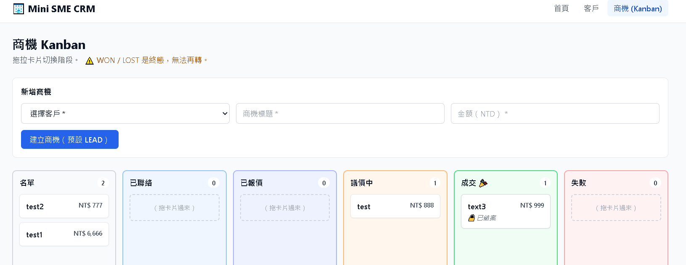
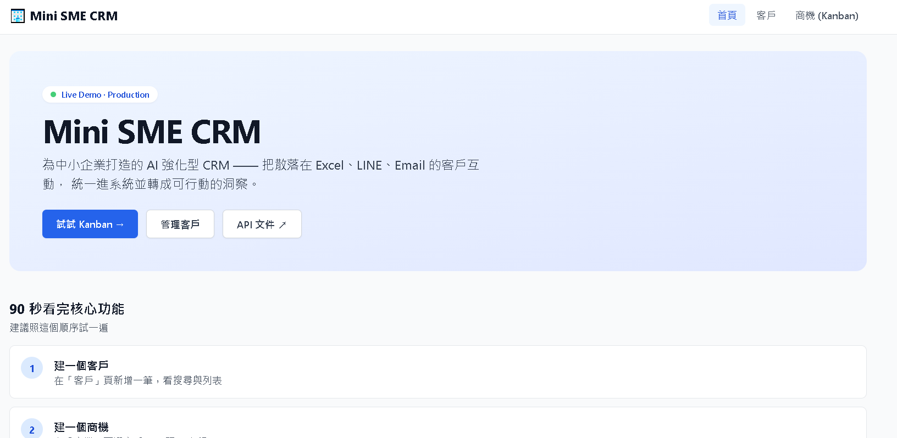
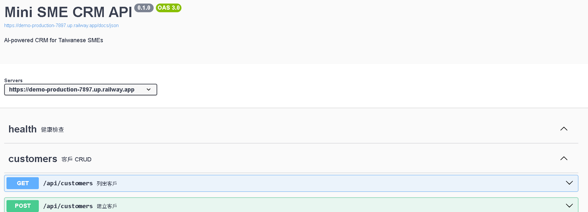

# Mini SME CRM — AI-powered CRM for Small & Medium Enterprises


為中小企業打造的 AI 強化型 CRM —— 把散落在 Excel、LINE、Email 的客戶互動，統一進系統並轉成可行動的洞察。

---

## 🌐 Live Demo

**🔗 前端 Demo：[https://demo-1l53.vercel.app/](https://demo-1l53.vercel.app/)**

**📚 API 文件（Swagger UI）**：從首頁的「Swagger UI」連結點進去

### 📸 Screenshots

#### 商機 Kanban — 拖拉卡片切換階段 + 終態鎖定



#### 首頁 — 給面試官的引導頁



#### Swagger UI — 從 Zod schema 自動產生的 API 文件



### 建議試用流程（90 秒看完核心功能）

1. **進首頁** → 看 3 個系統狀態卡
2. **點「客戶」** → 新增一個客戶（名字、Email、公司）
3. **點「商機 (Kanban)」** → 選剛建的客戶 + 標題 + 金額 → 建立
4. **拖卡片** 從「名單」拖到「報價」→ 觀察 UI 瞬間反應（optimistic update）
5. **拖到「成交 🎉」** → 卡片變灰、出現 🔒 已結案
6. **試著再拖 WON 卡片** → 拖不動（前端 disabled）
7. （想看後端機制）打開 Swagger UI → `PATCH /api/deals/{id}/stage` 改 stage 成 `LEAD` → **回應 409 Conflict**

---

## 🎯 解決的問題

台灣中小企業常見痛點：

- 業務團隊用 **Excel** 管客戶，公司一變大就難維護
- 客戶聯絡記錄散在 **LINE / Email / 紙本**，沒人能彙整
- 老闆問「這個月哪些案子快成交了？」沒人答得出來
- 想導入 AI 卻不知從何下手，只會包 ChatGPT 介面

這個 demo 解決：

1. **統一的客戶 + 商機資料模型** —— 取代 Excel + LINE 截圖
2. **Kanban Pipeline View** —— 業界標準的銷售階段視覺化
3. **狀態機保護** —— 終態 (WON/LOST) 鎖死，避免資料污染
4. **AI 強化（Phase 5+）** —— 摘要、評分、RAG、Agent

---

## 🤖 AI 能力 AI Capabilities

| 能力 | 技術 | 狀態 |
|------|------|------|
| 客戶摘要 | Claude API + structured JSON output（自動歸納「現況 + 下一步建議」） | ✅ Phase 5 |
| 商機 AI 評分 | Claude API + 多維度評分 prompt（0-100 分 + 理由，分數寫進 DB cache） | ✅ Phase 5 |
| **RAG 語意搜尋** | pgvector + Voyage AI embedding | 🔜 Phase 6 |
| **Agent** | Claude Tool Use + multi-turn loop | 🔜 Phase 7 |

---

## 🏗️ 技術架構

| 層級 | 技術 | 部署 |
|------|------|------|
| Web (前端) | Next.js 14 App Router + TanStack Query + dnd-kit + Tailwind | **Vercel** |
| API (後端) | Fastify + Zod (type provider) + fastify-plugin | **Railway** |
| DB | PostgreSQL 16 + Prisma ORM | Railway (managed) |
| AI | Claude API (`claude-sonnet-4-6`) | — |
| CI/CD | GitHub push → 自動觸發 Vercel + Railway 部署 | — |

### 為什麼用 Monorepo（pnpm workspace）

前後端共用 TypeScript types / Zod schemas / Prisma client，單一 PR 改動可同時影響全棧，避免前後端型別漂移：

```
@sme-crm/shared   ← Zod schemas + 自定義 Error 類別
@sme-crm/db       ← Prisma client + namespace re-export
@sme-crm/ai       ← Claude API wrapper（Phase 5+）
@sme-crm/api      ← Fastify server
@sme-crm/web      ← Next.js app
```

`packages/shared` 改一個 schema → API 自動拿到 → Next.js 自動拿到 → **零重複定義、零型別漂移**。

### 設計亮點

- **分層架構**：Route → Service → Data，service 用 constructor DI 注入 PrismaClient，方便測試與 transaction reuse
- **狀態機隔離**：Deal stage 轉移走專屬 endpoint，一般 PATCH 用 `Omit<>` 編譯期擋掉 stage 欄位（defense in depth）
- **HTTP 語意精準**：自定義 `ConflictError` (409) / `NotFoundError` (404) / `ValidationError` (400)，service 拋業務錯誤，errorHandler 統一翻譯成 HTTP
- **Optimistic UI**：拖卡片瞬間 UI 反應，後端 409 自動 rollback
- **Type-safe API client**：前端 fetch wrapper reuse 後端 Zod schema 推導型別
- **Swagger UI 自動產生**：route 寫 Zod schema → fastify-type-provider-zod 同時做 validation + OpenAPI

---

## 🚀 Quick Start（本機開發）

```powershell
# 1. 安裝
pnpm install

# 2. 起本機 PostgreSQL
pnpm db:up

# 3. 建表 + 塞範例資料
pnpm db:migrate
pnpm db:seed

# 4. 啟動 API（一個 terminal）
pnpm dev:api
# → http://localhost:3001/docs (Swagger UI)

# 5. 啟動前端（另一個 terminal）
pnpm dev:web
# → http://localhost:3000
```

完整步驟、踩雷預防見 [SETUP.md](./SETUP.md)。

---

## 📁 Monorepo Layout

```
mini-sme-crm/
├── packages/
│   ├── shared/      # 共用 TS types + Zod schemas + AppError 子類
│   ├── db/          # Prisma schema + client + seed
│   ├── ai/          # Claude API wrapper（Phase 5+）
│   ├── api/         # Fastify 後端 → Railway
│   │   ├── plugins/    # prisma, validation, error handler
│   │   ├── services/   # customer-service, deal-service
│   │   └── routes/     # /api/customers, /api/deals
│   └── web/         # Next.js 前端 → Vercel
│       ├── lib/        # api-client, query-keys
│       ├── components/ # KanbanBoard, DealCard, CustomerTable...
│       └── app/        # /, /customers, /deals
├── railway.json     # Railway 部署設定
├── vercel.json      # Vercel 部署設定
├── docker-compose.yml
├── pnpm-workspace.yaml
└── tsconfig.base.json
```

**依賴方向**：`web → api → ai → db → shared`（單向，無循環）

---

## 🗺️ Roadmap

| Phase | 主題 | 狀態 |
|-------|------|------|
| 0 | Monorepo 骨架 + 三件套文件 | ✅ |
| 1 | Customer CRUD + Fastify Plugin + Zod 驗證 | ✅ |
| 2 | Deal Kanban + 狀態機 + 409 Conflict 保護 | ✅ |
| 3 | Next.js 前端 + TanStack Query + dnd-kit 拖拉 | ✅ |
| **4** | **Railway + Vercel 部署上線** | ✅ |
| **5** | **ContactLog CRUD + Claude API 摘要 + 商機 AI 評分** | ✅ |
| **6** | **RAG**：pgvector + Voyage embedding 相似度檢索 | 🔜 |
| **7** | **Agent**：Claude Tool Use + 多輪對話 | 🔜 |
| 8 | LINE Bot 整合（bonus） | 🔜 |

詳細進度與每個 Phase 設計理由見 [PROGRESS.md](./PROGRESS.md)。

---

## 📄 License

MIT
