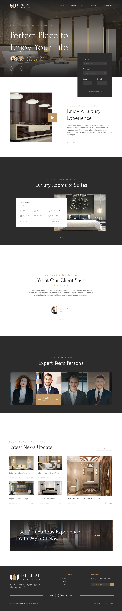

# Mini Stay · 精品民宿訂房網站


把一份 Figma 設計稿,交付成一個**像素級還原、三個斷點響應式、跨瀏覽器驗證過**的民宿訂房網站。單一 Nuxt 4 應用同時承載前端與 RESTful API。

> 🔗 **Live Demo**:(Phase 7 部署後補上)

## Demo 截圖

| 設計稿 (Figma) | 實作 (Playwright 截圖) |
|---|---|
|  | (Phase 2 補上) |

<!-- 預留:home / rooms / room-detail × chromium / firefox / webkit × 375 / 768 / 1280 -->

## 架構

```
Browser ──HTTP──▶ Vercel (Nitro `vercel` preset)
                     ├─ SSR: app/pages/*  ── useAsyncData ──▶ server/api/*  (同源,無 CORS)
                     │                                           │ Zod (shared/schemas)
                     │                                           ▼
                     │                                     server/db (Drizzle + postgres-js)
                     └─ /admin/* ── route middleware ─▶ server/middleware ─▶ Railway Postgres
```

## 技術點 ↔ 程式碼對照

| 職缺關鍵字 | 這個專案怎麼證明 | 位置 |
|---|---|---|
| 設計稿 → HTML | Figma tokens 抽成 SCSS 變數,逐段還原 | `app/assets/scss/_tokens.scss`、`docs/design/figma-notes.md` |
| CSS / SASS | 手寫 SCSS:tokens → mixins → BEM 元件,零 UI 框架 | `app/assets/scss/`、各元件 `<style lang="scss">` |
| 行動端響應式 | mobile-first `@include up()`、`clamp()` 流式字級、漢堡選單 | `app/assets/scss/_mixins.scss`、`app/components/AppHeader.vue` |
| 跨瀏覽器相容 | browserslist + autoprefixer;Playwright 3 引擎 × 3 視口截圖矩陣 | `package.json#browserslist`、`tests/e2e/` |
| Vue.js / Nuxt.js | `<script setup>` + SSR `useAsyncData` + Pinia + route/server middleware | `app/`、`server/` |
| RESTful API 整合 | Nitro `server/api` + Zod schema 前後端共用,409 衝突處理 | `server/api/`、`shared/schemas/` |
| jQuery | 舊版 jQuery 外掛包成 Vue 元件(strangler 遷移) | `app/components/LegacyDateRangePicker.client.vue` |
| 重構 | mock JSON → Drizzle 的獨立 commit,API 契約與測試零改動 | git log `refactor:` |

## 本地啟動

```bash
pnpm install
cp .env.example .env
pnpm dev
```

| 指令 | 用途 |
|---|---|
| `pnpm dev` | 開發伺服器 http://localhost:3000 |
| `pnpm lint` / `pnpm typecheck` | ESLint(@nuxt/eslint stylistic)/ vue-tsc |
| `pnpm build` / `pnpm preview` | 生產建置 / 本地預覽 |

## 設計取捨(知道不做、為何不做)

| 不做 | 為什麼 |
|---|---|
| Tailwind / Nuxt UI | 職缺看的是 CSS / SASS 功力,工具類會把它藏起來 |
| 獨立後端 | Nitro 已是 RESTful 層,拆出去只多一個部署面與 CORS |
| 完整 auth | 後台只有一個角色,單密碼 + 簽章 cookie 已涵蓋「路由保護」考點 |
| i18n、金流 | 職缺未提,會稀釋前端評估重點 |
| `@nuxt/image` | 六張固定圖,手動 webp 即可 |

## 設計稿來源

UI 設計:[Free Hotel Responsive Landing Page](https://www.figma.com/community/file/1377492425738686159/free-hotel-responsive-landing-page) by 8AM.DESIGN,[CC BY 4.0](https://creativecommons.org/licenses/by/4.0/)。品牌名稱與文案為本專案替換,版面、色彩與字型忠於原稿。

## 授權

MIT
