# MultiPlex Analyzer HMI

桌上型多重檢測分析儀的觸控操作台(WPF / .NET 9)。這個作品專門展示 XAML 深度:設計 token 主題系統與即時 Dark / Light 切換、手繪幾何、VisualStateManager 轉場、lookless 自訂控制項、單一 `OnRender` 畫出的 96 孔盤面(觸控 + 滑鼠雙軌手勢),以及頁面上直接顯示的效能數字。**刻意不做後端。**

> A touch-first WPF operator console for a benchtop multiplex diagnostic analyzer. Built to demonstrate production-grade XAML: design-token theming with live Dark/Light switching, hand-drawn geometry, VisualStateManager transitions, lookless custom controls, and a single-`OnRender` 96-well plate map with touch and mouse gestures. No backend by design.

**下載試用:** [Release v1.0.0](https://github.com/joy20020606/demo/releases/tag/hmi-v1.0.0) — 單檔 exe,不用裝 .NET
**Figma 設計稿:** [MultiPlex HMI Design System](https://www.figma.com/design/W9LbmGUGTpC2e8KO5f2ew9/Untitled?node-id=1-159)(Design System page 有 variables 與 8 個 component,Screens page 有 4 張畫面 × Light / Dark)

## Figma 稿 vs 實作

設計稿由 `figma-plugin/` 裡的外掛從同一份 token 表生成,與 XAML 的 resource key 一對一同名。

| Figma | WPF |
|---|---|
| 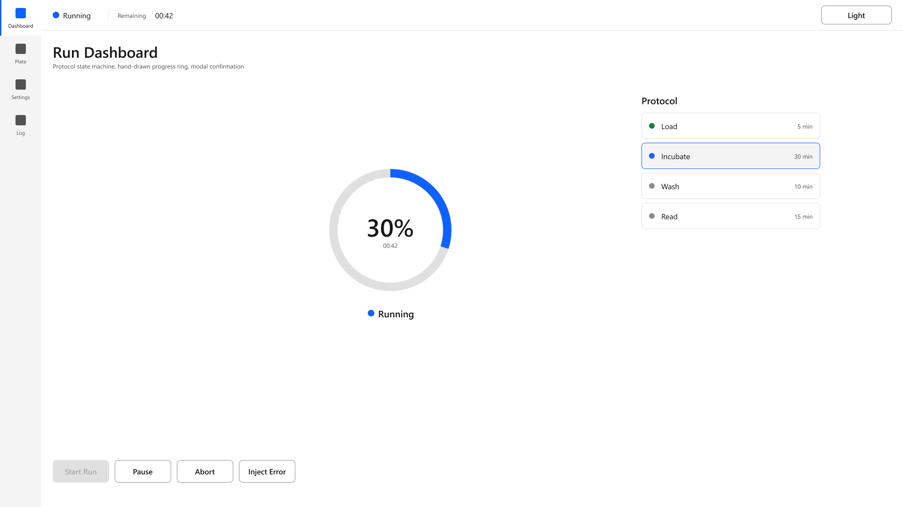 | 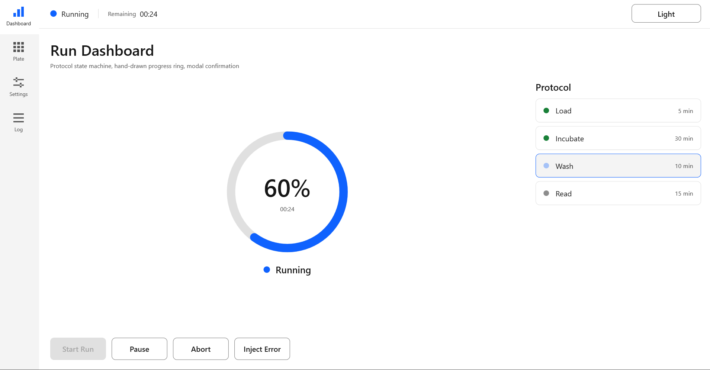 |
| 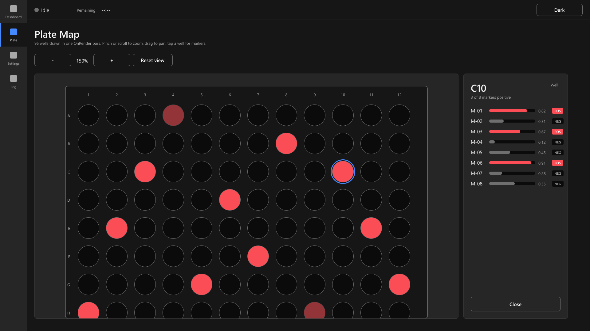 | 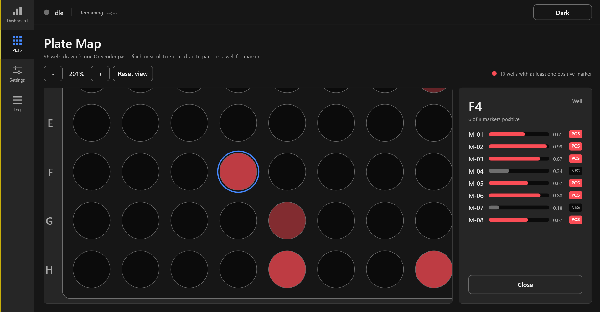 |
| 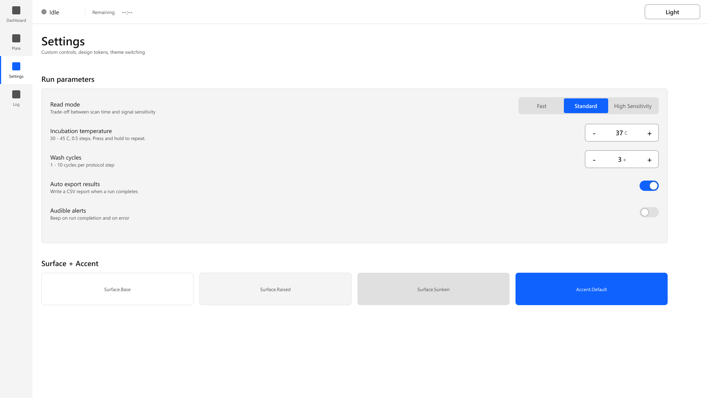 | 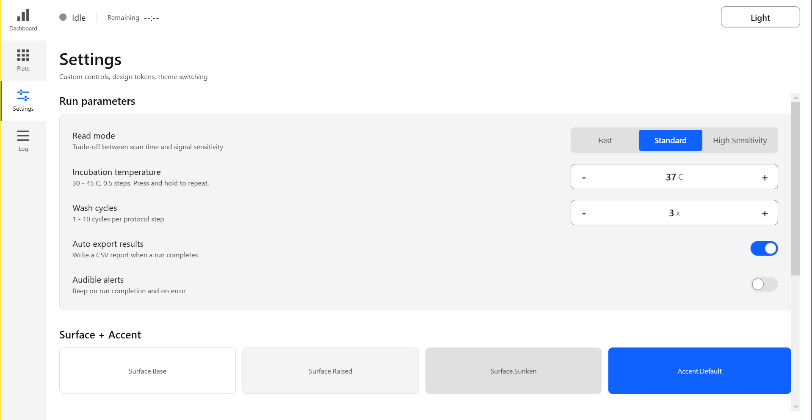 |
| 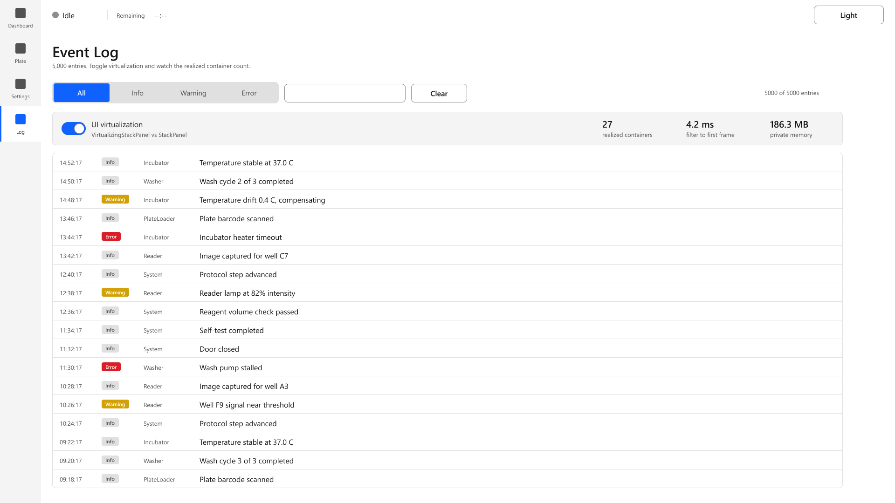 | 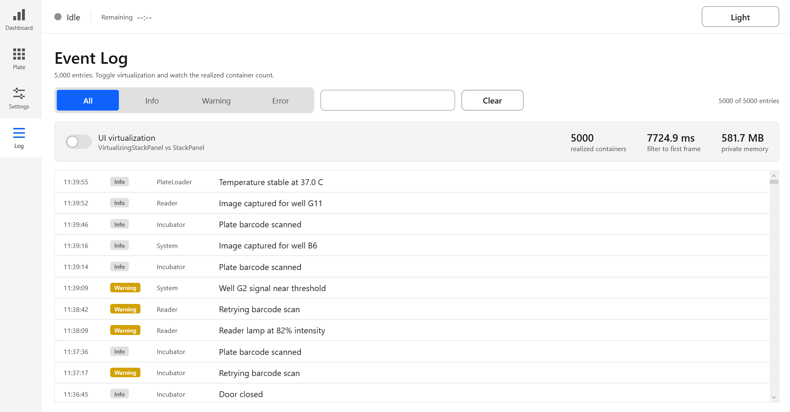 |

| 主題切換 | 狀態機 | 孔盤手勢 |
|---|---|---|
| 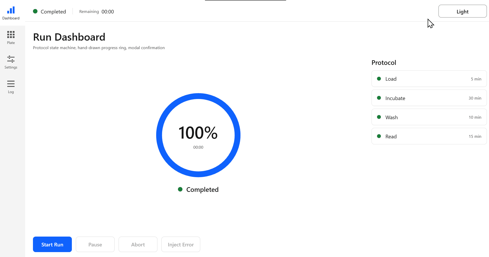 | 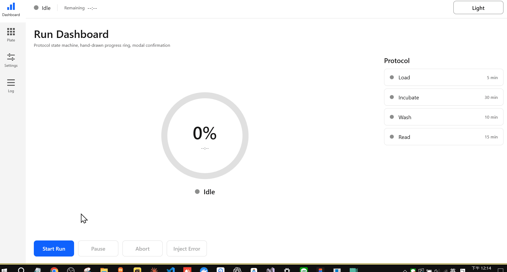 | 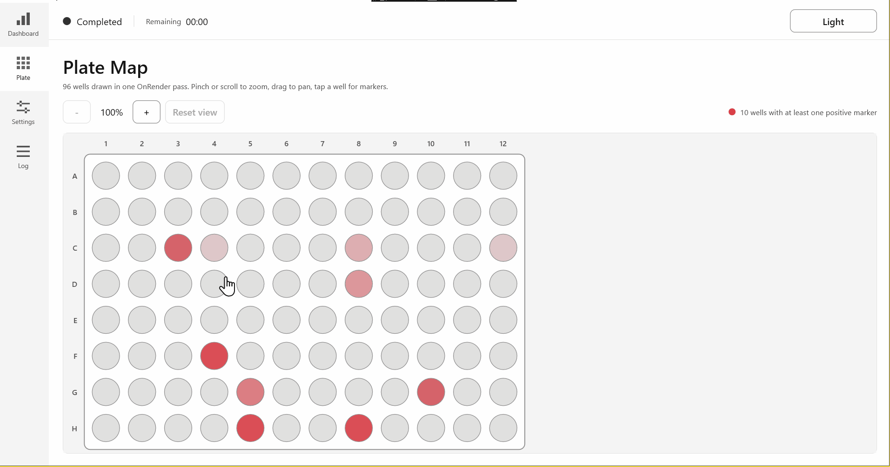 |

---

## 為什麼做這個

WPF / XAML UI 工程師這類職缺,通常要求從 Figma 設計稿實作 Windows 桌面 UI,重點在 Style / Theme / MVVM / 自訂控制項 / Touch / 動畫 / 效能。這個 repo 是針對那組需求的直接回答:**每一頁都為了展示一項技能而存在,沒有多做別的。**

| 常見要求 | 在哪裡 |
|---|---|
| Figma → WPF/XAML 實作 | `docs/design-token-map.md` — Figma variable 與 XAML key 一對一同名 |
| Style / ResourceDictionary / ControlTemplate | `Themes/` — token、字級、尺寸,每個控制項一本字典 |
| Dark / Light 主題、DynamicResource | `Theming/ThemeService.cs` — 執行期抽換一本字典,視窗不重開 |
| MVVM、Data Binding、Trigger | `ViewModels/` 用 CommunityToolkit.Mvvm;導覽靠 DataTemplate,沒有 navigation service |
| 客製化控制項、Touch 介面 | `Controls/` — NumericStepper、ProgressRing、PlateMapControl;48 dp 觸控目標寫在 base style |
| Animation、Storyboard、Geometry / Path | ProgressRing(`ArcSegment`)、ToggleSwitch(VSM)、換頁轉場、Modal 對話框、步驟脈動 |
| UI 測試、Debug、效能優化 | Event Log 頁即時顯示 realized container 數、刷新耗時、記憶體;16 個 ViewModel 單元測試 |
| Git | 一個 Phase 一顆 commit,conventional message |

---

## 四個畫面

**Run Dashboard** — protocol 狀態機(`Idle → Running ⇄ Paused → Completed / Error`)、手繪進度環(帶緩動補間)、四步驟時間軸(目前步驟呼吸閃爍)、Abort 的 Modal 確認框。按鈕的 enable / disable 完全靠 `CanExecute`,XAML 裡沒有任何 `IsEnabled`。

**Plate Map** — 96 孔在一次 `OnRender` 畫完(一個 visual,不是 96 個元素)。滾輪 / pinch 以指標為中心縮放、拖曳平移、點孔滑入 8 條指標的明細面板。孔的顏色是兩個 token 之間 9 階的插值,切主題會正確重繪。

**Settings** — 三個自訂控制項(SegmentedControl、長按連發的 NumericStepper、VSM 轉場的 ToggleSwitch),加上 token 展示台,含 `StaticResource` vs `DynamicResource` 並排對照。

**Event Log** — 5,000 筆資料走 `ICollectionView` 篩選。一個開關在執行期把 `VirtualizingStackPanel` 換成 `StackPanel`,頁面即時顯示 realized container 數、篩選到第一幀的時間、private memory。

---

## 值得被問的七個設計決策

1. **主題切換只抽換一本字典。** `Tokens.Light.xaml` 和 `Tokens.Dark.xaml` key 完全相同,固定放在 `MergedDictionaries[0]`;Sizing、Typography、控制項樣式全部不動。會隨主題變的用 `DynamicResource`,其他用 `StaticResource` —— 因為每個 DynamicResource 都要註冊監聽,在孔盤那種高密度畫面會累積成本。

2. **控制項樣式裡沒有任何字面色碼。** 所有畫刷都是 token key。要加高對比主題,只是多一個字典檔。

3. **狀態 → 顏色走 DataTrigger,不走 Converter。** Converter 回傳的是具體的 `Brush`,主題切換時不會更新。`Themes/Controls/Status.xaml` 把每個 `RunState` 對到一個 `DynamicResource`,兩個機制才不會打架。

4. **導覽是 DataTemplate 查表。** `ContentControl.Content` 綁 ViewModel,WPF 依型別找對應的 `DataTemplate`。新增一頁 = 加一條 template。孔盤明細面板的指標列也是同一套查表在渲染。

5. **自訂控制項是 lookless 且無領域字眼。** `Controls/` 裡找不到 temperature、plate、run 這些字。`NumericStepper` 的 `Value` 註冊成 `BindsTwoWayByDefault`、用 `CoerceValue` 夾範圍;樣板靠 `PART_` 命名約定接上。`PlateMapControl` 把畫刷做成帶 `AffectsRender` 的 DependencyProperty,讓主題驅動繪製。

6. **觸控和滑鼠是兩條輸入路徑,進同一個模型。** `ManipulationDelta`(觸控)和 `MouseWheel` / 拖曳(滑鼠)最後都呼叫同一組 `ZoomAt` / `Pan` / `WellAt`。開了 manipulation 之後觸控不會再被升級成滑鼠事件,兩條路不會互相干擾。

7. **量測程式碼刻意放在 code-behind。** 數 realized `ListBoxItem` 需要 `ItemContainerGenerator`,那是 View 的內部狀態。ViewModel 只發 `MeasurementRequested` 事件、收數字回來,從頭到尾沒看過 `ListBox`。

---

## 刻意不做

| 不做 | 理由 |
|---|---|
| 後端 / API / 資料庫 | 不在這個作品的範圍。`IDeviceService`、`IPlateService`、`ILogService` 是介面 + 假實作,接真機時換實作即可 |
| 第三方 UI / 圖表套件 | 這份作品要證明的正是 `ControlTemplate` 和繪製能力,套套件等於把答案遮住 |
| 真實檢測項目名稱、protocol 化學細節 | 我沒有實際規格。指標用 `M-01 … M-08`,protocol 是四個泛用步驟 |
| 多語系、表單驗證 | 兩者都是常見題,不是這個作品要展示的 |
| DI 容器 | `ShellViewModel` 保留無參數建構子給 XAML 用,另有完整建構子供注入。Production 會拿掉前者 |

**觸控路徑未於實體觸控面板驗證。** Manipulation 程式碼已實作且與滑鼠路徑共用邏輯,但開發期間沒有觸控硬體。

---

## 執行

**不想裝環境?** 直接下載 [Release v1.0.0](https://github.com/joy20020606/demo/releases/tag/hmi-v1.0.0) 的 `MultiplexAnalyzer.exe`,Windows 10 / 11 雙擊即可,不需要安裝 .NET。

從原始碼跑:

```bash
dotnet run --project src/MultiplexAnalyzer.Hmi
```

```bash
dotnet test
```

```bash
dotnet publish src/MultiplexAnalyzer.Hmi -c Release -r win-x64 --self-contained true -p:PublishSingleFile=true -p:IncludeNativeLibrariesForSelfExtract=true -o publish
```

建置需要 .NET 9 SDK。打包出來的 `MultiplexAnalyzer.exe` 是 self-contained 單檔,Windows 10 / 11 不用裝 runtime 就能跑。

---

## 目錄結構

```
src/MultiplexAnalyzer.Hmi/
├── Themes/              設計層 — 純 XAML,零 C#
│   ├── Tokens.Light.xaml / Tokens.Dark.xaml   各 17 個 Brush,key 完全一致
│   ├── Sizing.xaml / Typography.xaml / Icons.xaml
│   ├── Controls/        每個控制項一本樣式字典
│   └── DataTemplates.xaml   ViewModel → View 對應表
├── Theming/             ThemeService — 抽換 MergedDictionaries[0]
├── Controls/            lookless 自訂控制項,無領域字眼
├── Converters/
├── ViewModels/          CommunityToolkit.Mvvm;command 與 property 由 source generator 產生
├── Views/               一頁一個 UserControl
├── Models/              record 與 enum
└── Services/            介面 + 假實作

tests/MultiplexAnalyzer.Tests/   16 個 xUnit 測試,只測 ViewModel,不需要 WPF runtime
docs/                            token 對照表、效能筆記、Figma 清單、領域小抄
```

---

## 文件

- [`docs/design-token-map.md`](docs/design-token-map.md) — Figma variable ↔ XAML key ↔ Light / Dark 值
- [`docs/performance.md`](docs/performance.md) — 虛擬化與繪製的量測方法和數據
- [`docs/figma-checklist.md`](docs/figma-checklist.md) — Figma 檔要建什麼、怎麼對到程式碼
